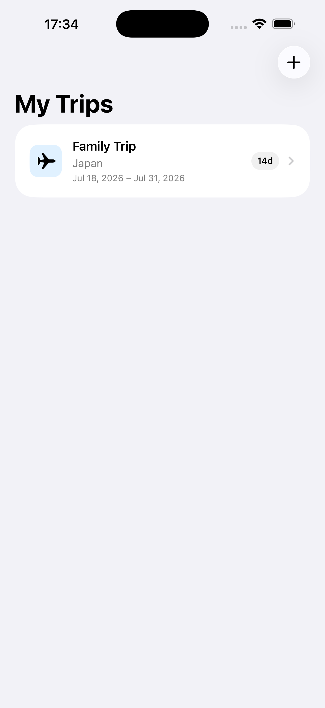
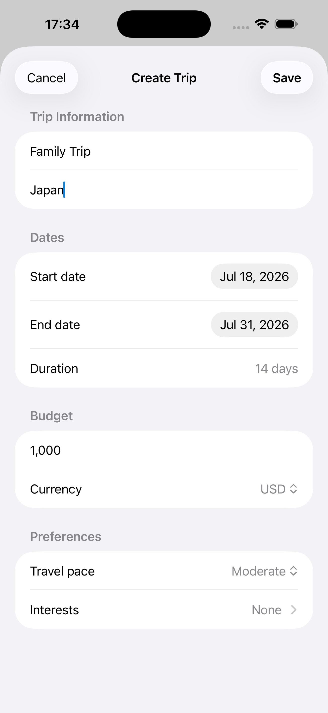
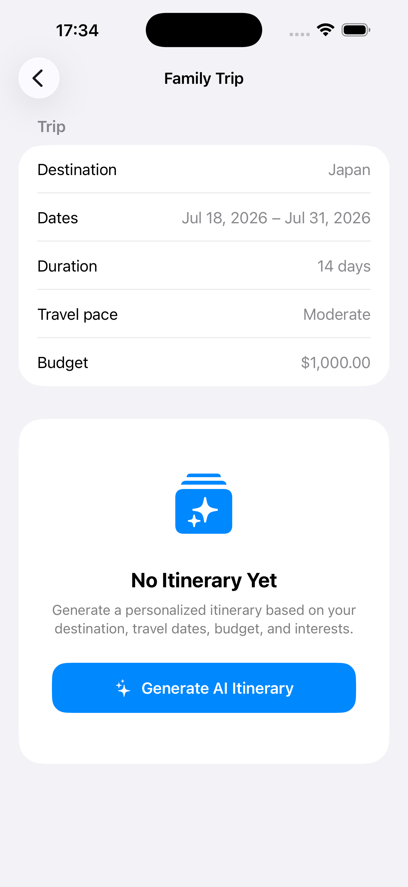
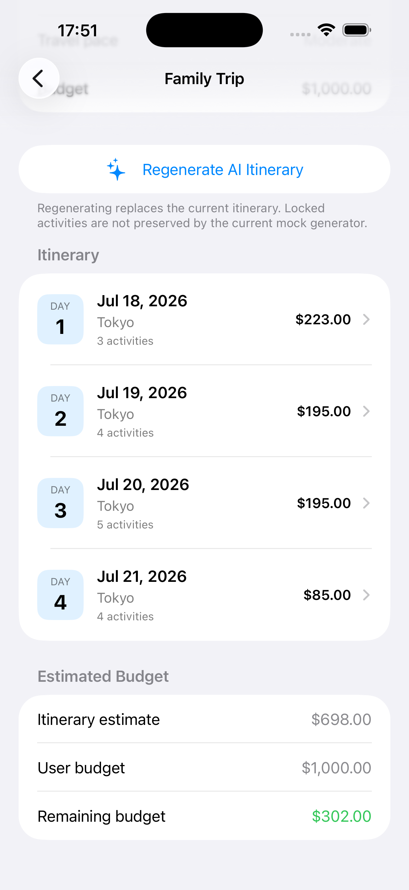
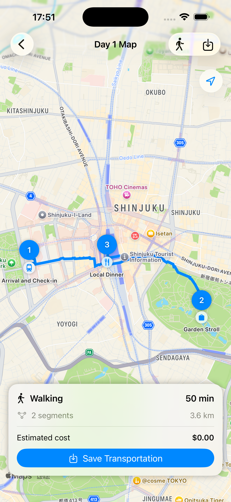

# Lemon Travel Planner iOS App

TravelPlanner is an iOS itinerary-planning app built with SwiftUI, SwiftData, MapKit, and a local LLM served by LM Studio.

The app lets users create trips, generate day-by-day itineraries, edit activities, search for real places, display locations on a map, calculate routes, estimate costs, and save transportation information.

## Screenshots
|Home Page|Create Trip|Trip View|AI Itinernary|Route Map|
|||
|||

## Technology

- Swift and SwiftUI
- SwiftData
- MapKit
- LM Studio local API
- OpenAI-compatible chat-completions endpoint

## Requirements

- macOS with Xcode
- iOS 17 or later
- LM Studio installed
- A model loaded in LM Studio
- LM Studio local server running

## Project structure

A typical project structure is:

```text
TravelPlanner/
├── App/
│   └── TravelPlannerApp.swift
├── Models/
│   ├── Trip.swift
│   ├── TripDay.swift
│   ├── Activity.swift
│   ├── TransportationSegment.swift
│   ├── TravelPreferences.swift
│   ├── TravelMode.swift
│   ├── ItineraryAPIModels.swift
│   ├── LMStudioAPIModels.swift
│   └── JSONValue.swift
├── Services/
│   ├── ItineraryService.swift
│   ├── ItineraryGenerator.swift
│   ├── LMStudioItineraryService.swift
│   ├── PlaceSearchService.swift
│   └── RouteService.swift
└── Features/
    ├── Home/
    ├── TripCreation/
    └── Itinerary/
        ├── TripDetailView.swift
        ├── TripDayDetailView.swift
        ├── TripDayMapView.swift
        ├── ActivityFormView.swift
        └── PlaceSearchView.swift
```

## Start LM Studio

1. Open LM Studio.
2. Load an instruction-following model.
3. Open the **Developer** section.
4. Start the local server.
5. Confirm the API Usage panel displays a server address and model identifier.

Example configuration:

```text
Server URL: http://127.0.0.1:1234
Model identifier: google/gemma-4-e4b
```

Keep LM Studio open and keep the model loaded while using AI itinerary generation.

## Test the LM Studio server

Open Terminal and run:

```bash
curl http://127.0.0.1:1234/v1/models
```

A successful response should contain the identifier of the model loaded in LM Studio.

You can also test text generation:

```bash
curl http://127.0.0.1:1234/v1/chat/completions \
  -H "Content-Type: application/json" \
  -d '{
    "model": "google/gemma-4-e4b",
    "messages": [
      {
        "role": "user",
        "content": "Return a short JSON greeting."
      }
    ],
    "temperature": 0.2
  }'
```

# AI Configuration

All AI settings are located in:

``` text
App/AppConfiguration.swift
```

Example:

``` swift
import Foundation

enum AppConfiguration {

    enum AIProvider {
        case mock
        case lmStudio
        case openAI
    }

    static let provider: AIProvider = .lmStudio

    static let lmStudioBaseURL = URL(
        string: "http://127.0.0.1:1234"
    )!

    static let lmStudioModel =
        "google/gemma-4-e4b"

    static let backendURL = URL(
        string: "https://your-api.com"
    )!
}
```
# LM Studio Setup

1.  Install LM Studio.
2.  Download a supported instruct model.
3.  Start the Local Server.
4.  Confirm:

``` text
http://127.0.0.1:1234
```

Check models:

``` bash
curl http://127.0.0.1:1234/v1/models
```

Use the returned model ID in:

``` swift
static let lmStudioModel =
    "google/gemma-4-e4b"
```

# URL Configuration

## iOS Simulator

``` swift
static let lmStudioBaseURL =
URL(string:"http://127.0.0.1:1234")!
```

## Physical iPhone

Replace with your Mac's LAN IP:

``` swift
static let lmStudioBaseURL =
URL(string:"http://192.168.1.25:1234")!
```

Enable **Serve on Local Network** in LM Studio.

# Switching AI Providers

## Mock

``` swift
static let provider: AIProvider = .mock
```

## LM Studio

``` swift
static let provider: AIProvider = .lmStudio
```

## OpenAI Backend

``` swift
static let provider: AIProvider = .openAI
```

## Allow local HTTP networking

LM Studio normally serves its local API over HTTP. In Xcode:

1. Select the blue TravelPlanner project.
2. Select the TravelPlanner app target.
3. Open the **Info** tab.
4. Under **Custom iOS Target Properties**, add **App Transport Security Settings**.
5. Inside it, add **Allow Local Networking**.
6. Set it to **YES**.

The generated setting is equivalent to:

```xml
<key>NSAppTransportSecurity</key>
<dict>
    <key>NSAllowsLocalNetworking</key>
    <true/>
</dict>
```

Use this for local development. Production services should normally use HTTPS.

## Simulator and physical-device configuration

### iOS Simulator

Use:

```swift
http://127.0.0.1:1234
```

The simulator can normally reach the LM Studio server running on the same Mac.

### Physical iPhone

Use the Mac's LAN address:

```swift
http://192.168.x.x:1234
```

Also confirm:

- The Mac and iPhone are connected to the same Wi-Fi network.
- LM Studio is configured to serve on the local network.
- macOS Firewall allows incoming connections for LM Studio.
- The app has Local Network permission when iOS requests it.

For local-network access, you may also need to add this target property:

```text
Privacy - Local Network Usage Description
```

Example value:

```text
TravelPlanner connects to your local LM Studio server to generate trip itineraries.
```

## Generate an itinerary

1. Start LM Studio and load the configured model.
2. Start the LM Studio local server.
3. Run TravelPlanner in the iOS Simulator.
4. Create a trip.
5. Open the trip.
6. Tap **Generate AI Itinerary**.
7. Wait for the local model to return the structured itinerary.

Generation speed depends on the model, Mac hardware, context length, and number of trip days.

## Important files for AI generation

### `TripDetailView.swift`

Creates the itinerary generator and starts generation when the user taps the AI button.

### `LMStudioItineraryService.swift`

Sends the request to LM Studio and decodes the model response.

The endpoint should normally be:

```text
/v1/chat/completions
```

### `ItineraryGenerator.swift`

Converts the generated response into SwiftData models such as `TripDay` and `Activity`.

### `ItineraryAPIModels.swift`

Defines the request and response structures used by the app.

### `AppConfiguration.swift`

Recommended location for the LM Studio URL and model identifier.

## Troubleshooting

### Cannot connect to LM Studio

Confirm that:

- LM Studio is open.
- A model is loaded.
- The local server is running.
- The configured port is correct.
- `curl http://127.0.0.1:1234/v1/models` works.
- Local networking is allowed in the app target.

### The model identifier is invalid

Copy the exact value shown under **API Model Identifier** in LM Studio and update:

```swift
AppConfiguration.lmStudioModelIdentifier
```

### The simulator works but a physical iPhone does not

Replace `127.0.0.1` with the Mac's LAN IP address and enable network serving in LM Studio.

### The generated itinerary cannot be decoded

The model may have returned text outside the expected JSON structure. Try:

- Lowering temperature.
- Using a stronger instruction-following model.
- Reducing the number of requested trip days.
- Reviewing the raw response printed by `LMStudioItineraryService`.
- Ensuring the model supports reliable structured output.

### Generation takes too long

- Use a smaller or more heavily quantized model.
- Reduce the number of itinerary days.
- Reduce the maximum output-token value.
- Close other memory-intensive applications.

## Privacy

When LM Studio runs locally, itinerary prompts and generated content stay on the local machine unless another external service is called. MapKit place searches and routes are separate from LM Studio and may use Apple's network services.

## Current development configuration

```text
LM Studio URL: http://127.0.0.1:1234
Model identifier: google/gemma-4-e4b
```

For the cleanest setup, place both values in `AppConfiguration.swift` and avoid scattering them across different views or services.
